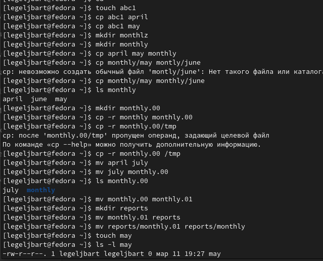
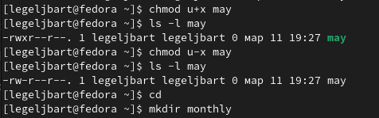
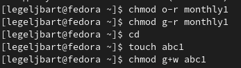
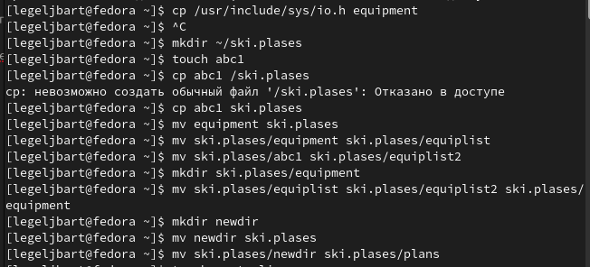
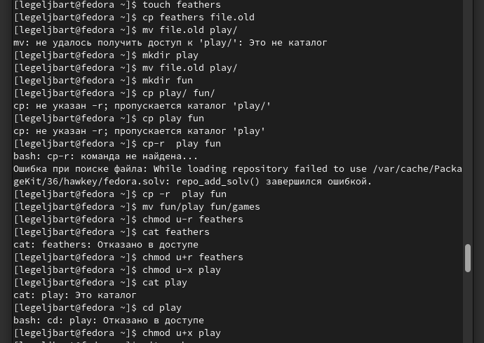

---
## Front matter
lang: ru-RU
title: Лабораторная работа 5
author:
  - Гельбарт лев
institute:
  - Российский университет дружбы народов, Москва, Россия
date: 11 марта 2023

## i18n babel
babel-lang: russian
babel-otherlangs: english

## Formatting pdf
toc: false
toc-title: Содержание
slide_level: 2
aspectratio: 169
section-titles: true
theme: metropolis
header-includes:
 - \metroset{progressbar=frametitle,sectionpage=progressbar,numbering=fraction}
 - '\makeatletter'
 - '\beamer@ignorenonframefalse'
 - '\makeatother'
---

## Цели и задачи

Освоить файловую систему linux

## Пример 1

{#fig:001 width=70%}

## Пример 2

{#fig:002 width=70%}

## Пример 3

{#fig:003 width=70%}

## Пункт 2

{#fig:004 width=70%}

Выполним запрошенные операции. Копируем файл io.h в домашнюю папку под именем equipment. Создаем каталог ski.plases в домашней папке. Перемещаем скопированный файл в этот каталог. Переименовывем equipment в equiplist. Создаем файл абс1 в домашне папке. Перемещаем его в ski.plases под именем equiplist2. Создаем каталог equipment в ski.plases, перемещаем в него equiplist и equiplist2. Создаем новую папку и перемещаем в ski.plases под именем plans (рис. @fig:004)

## Пункт 3

Нужные команды для подпунктов:
3.1 chmod a+x australia
3.2 chmod o-r, g+x, o+x play
3.3 chmod u+x, u-w my_os
3.4 chmod g+w feathers

## Пункт 4

{#fig:005 width=70%}

## Выводы

Освоены команды файловой системы Linux.

