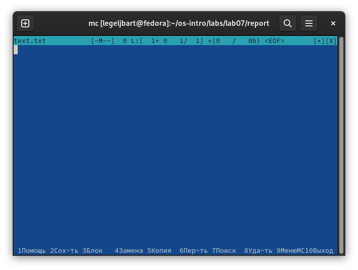
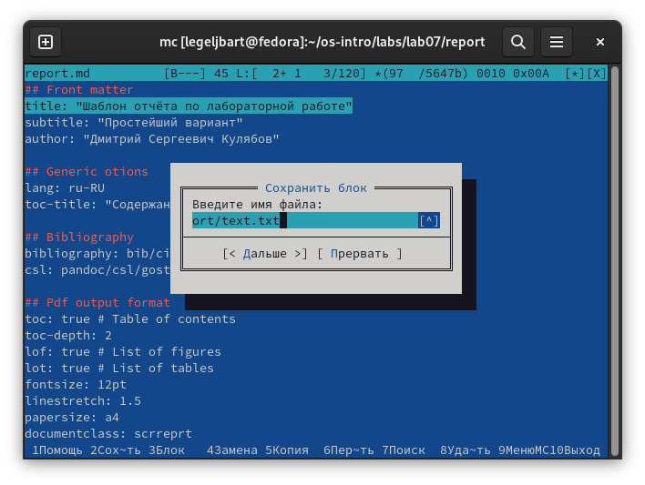
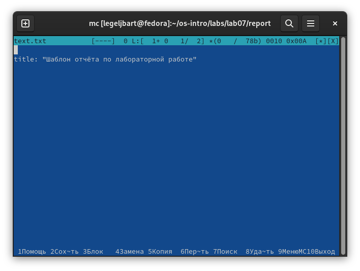
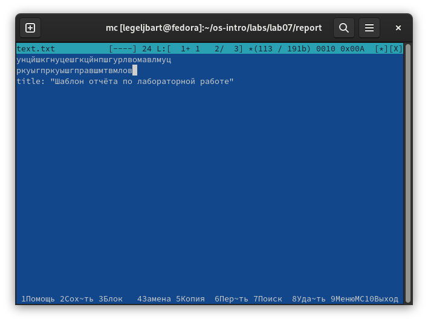
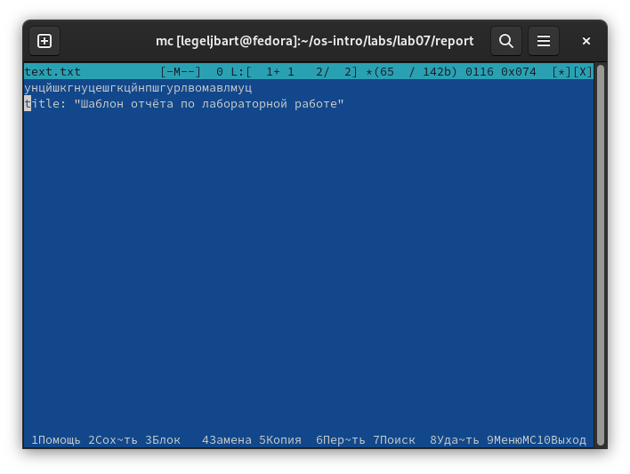
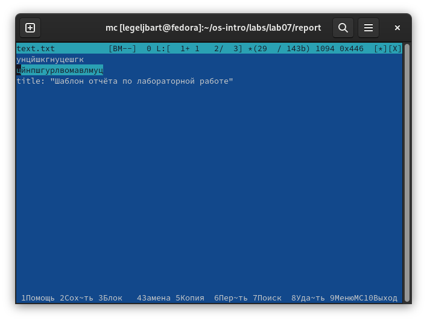
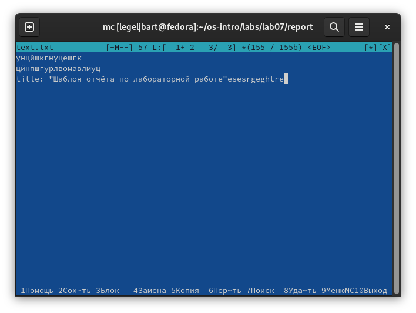
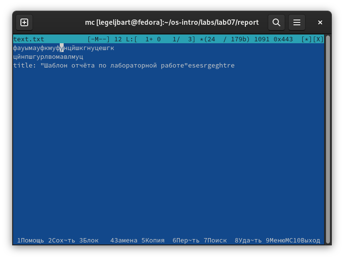
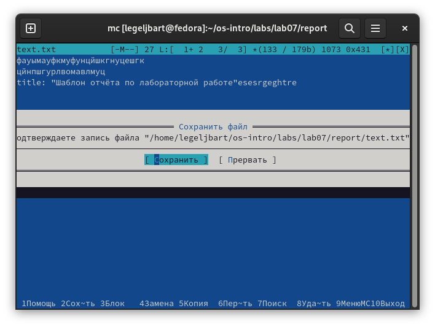
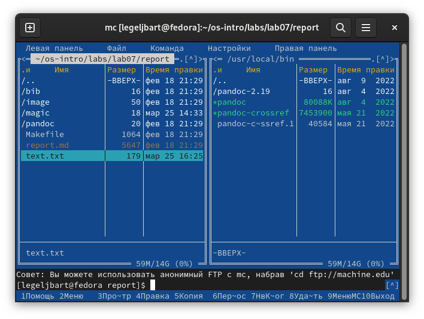

---
## Front matter
lang: ru-RU
title: Лабораторная работа 7
author:
  - Гельбарт Лев
institute:
  - Российский университет дружбы народов, Москва, Россия
date: 25 февраля 2023

## i18n babel
babel-lang: russian
babel-otherlangs: english

## Formatting pdf
toc: false
toc-title: Содержание
slide_level: 2
aspectratio: 169
section-titles: true
theme: metropolis
header-includes:
 - \metroset{progressbar=frametitle,sectionpage=progressbar,numbering=fraction}
 - '\makeatletter'
 - '\beamer@ignorenonframefalse'
 - '\makeatother'
---

## Цели и задачи

- Освоить функционал файлового менеджера mc
- Освоить функционал внутреннего редактора файлов mc

## Основы mc

Командой mc вызываем менеджер. Командой F3 открываем файл для просмотра без редактирования, F4 открываем для редактирования, F10 - для выхода. Создание каталога - клавиша F7. Копирование файла выполняется с помощью команды F5 при открытие каталога, куда копируется файл, в правой панели. В меню команд все действия интуитивно понятны. 

## Меню внешнего вида mc

С помощью настроек, меню внешнего вида, можно менять разбиение панелей на горизонтальное или же менять их размерное соотношение в окне. В оформлении можно менять скин - т.е. внешний вид и цвета интерфейса. В меню настроек панели можно редактировать такие параметры как показывать или не показывать скрытые файлы.

## Встроенный редактор mc 1

С помощью комбинации Shift+F4 создаем пустой файл, с F2 сохраняем его как  text.txt

{#fig:001 width=70%}

## Встроенный редактор mc 2

Теперь в шаблоне отчета был с помощью F3 выделен фрагмент текста. Нажатием F9 и "файл" был выбран "копировать в файл" - в файл text.txt 

{#fig:002 width=70%}

{#fig:003 width=70%}

## Встроенный редактор mc 3

Печатаем несколько случайных строк текста. С помощью комбинации Ctrl+y удаляем одну из них

{#fig:004 width=70%}

{#fig:005 width=70%}

## Встроенный редактор mc 4

F3 была выделена часть первой строки и нажатием F6 и Enter перенесена на новую строку 

{#fig:006 width=70%}

## Встроенный редактор mc 5

Комбинацией Ctrl+End был совершен переход в конец файла, дописан еще набор символов

{#fig:007 width=70%}

Аналогично комбинацией Ctrl+Home был совершен переход в начало файла, дописан еще набор символов

{#fig:008 width=70%}

## Встроенный редактор mc 6

Клавишей F2 файл сохранен, F10 совершен выход 

{#fig:009 width=70%}

{#fig:010 width=70%}

Открытие программных файлов происходит аналогично, через F3 и F4

## Вывод

Был освоен функционал файлового менеджера mc и его внутреннего редактора файлов.
