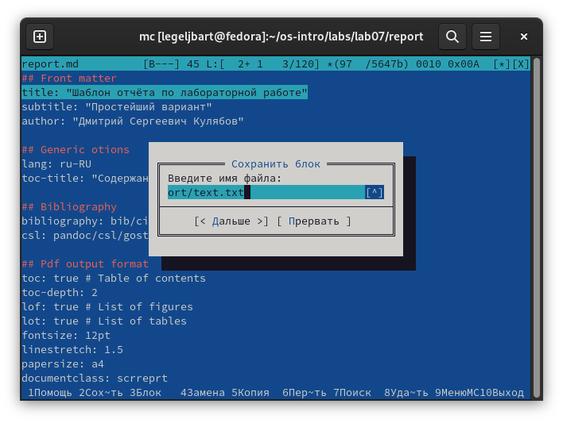

---
## Front matter
title: "Отчет по лабораторной работе 7"
author: "Лев Гельбарт"

## Generic otions
lang: ru-RU
toc-title: "Содержание"

## Bibliography
bibliography: bib/cite.bib
csl: pandoc/csl/gost-r-7-0-5-2008-numeric.csl

## Pdf output format
toc: true # Table of contents
toc-depth: 2
lof: true # List of figures
lot: true # List of tables
fontsize: 12pt
linestretch: 1.5
papersize: a4
documentclass: scrreprt
## I18n polyglossia
polyglossia-lang:
  name: russian
  options:
	- spelling=modern
	- babelshorthands=true
polyglossia-otherlangs:
  name: english
## I18n babel
babel-lang: russian
babel-otherlangs: english
## Fonts
mainfont: PT Serif
romanfont: PT Serif
sansfont: PT Sans
monofont: PT Mono
mainfontoptions: Ligatures=TeX
romanfontoptions: Ligatures=TeX
sansfontoptions: Ligatures=TeX,Scale=MatchLowercase
monofontoptions: Scale=MatchLowercase,Scale=0.9
## Biblatex
biblatex: true
biblio-style: "gost-numeric"
biblatexoptions:
  - parentracker=true
  - backend=biber
  - hyperref=auto
  - language=auto
  - autolang=other*
  - citestyle=gost-numeric
## Pandoc-crossref LaTeX customization
figureTitle: "Рис."
tableTitle: "Таблица"
listingTitle: "Листинг"
lofTitle: "Список иллюстраций"
lotTitle: "Список таблиц"
lolTitle: "Листинги"
## Misc options
indent: true
header-includes:
  - \usepackage{indentfirst}
  - \usepackage{float} # keep figures where there are in the text
  - \floatplacement{figure}{H} # keep figures where there are in the text
---

# Цель работы

Освоение функционала файлового менеджера mc и его внутреннего редактора файлов.

# Выполнение лабораторной работы

Командой mc вызываем менеджер. Командой F3 открываем файл для просмотра без редактирования, F4 открываем для редактирования, F10 - для выхода. Создание каталога - клавиша F7. Копирование файла выполняется с помощью команды F5 при открытие каталога, куда копируется файл, в правой панели. В меню команд все действия интуитивно понятны. 
С помощью настроек, меню внешнего вида, можно менять разбиение панелей на горизонтальное или же менять их размерное соотношение в окне. В оформлении можно менять скин - т.е. внешний вид и цвета интерфейса. В меню настроек панели можно редактировать такие параметры как показывать или не показывать скрытые файлы.

Перейдем к встроенному редактору.
С помощью комбинации Shift+F4 создаем пустой файл, с F2 сохраняем его как  text.txt (рис. @fig:001).

{#fig:001 width=70%}

Теперь в шаблоне отчета был с помощью F3 выделен фрагмент текста. Нажатием F9 и "файл" был выбран "копировать в файл" - в файл text.txt (рис. @fig:002, @fig:003).

{#fig:002 width=70%}

{#fig:003 width=70%}

Печатаем несколько случайных строк текста. С помощью комбинации Ctrl+y удаляем одну из них (рис. @fig:004, @fig:005).

{#fig:004 width=70%}

{#fig:005 width=70%}

F3 была выделена часть первой строки и нажатием F6 и Enter перенесена на новую строку (рис. @fig:006).

{#fig:006 width=70%}

Комбинацией Ctrl+End был совершен переход в конец файла, дописан еще набор символов (рис. @fig:007).

{#fig:007 width=70%}

Аналогично комбинацией Ctrl+Home был совершен переход в начало файла, дописан еще набор символов (рис. @fig:008).

{#fig:008 width=70%}

Клавишей F2 файл сохранен, F10 совершен выход (рис. @fig:009, @fig:010).

{#fig:009 width=70%}

{#fig:010 width=70%}

Открытие программных файлов происходит аналогично, через F3 и F4, мне такие файлы в машине найти не удалось.

# Выводы

Был освоен функционал файлового менеджера mc и его внутреннего редактора файлов.

