---
## Front matter
lang: ru-RU
title: Презентация по лабораторной работе 9
author:
  - Гельбарт Лев
institute:
  - Российский университет дружбы народов, Москва, Россия
date: 08 апреля 2023

## i18n babel
babel-lang: russian
babel-otherlangs: english

## Formatting pdf
toc: false
toc-title: Содержание
slide_level: 2
aspectratio: 169
section-titles: true
theme: metropolis
header-includes:
 - \metroset{progressbar=frametitle,sectionpage=progressbar,numbering=fraction}
 - '\makeatletter'
 - '\beamer@ignorenonframefalse'
 - '\makeatother'
---

## Цели и задачи

- Разобраться с редактором emacs, с его интерфейсом и функционалом.

## Упражнения

- Начнем написав emacs, этим запускаем редактор. Создаем файл Ctrl-x Ctrl-f. Вписываем в него нужный нам текст, сохраняем его Ctrl-x Ctrl-s 
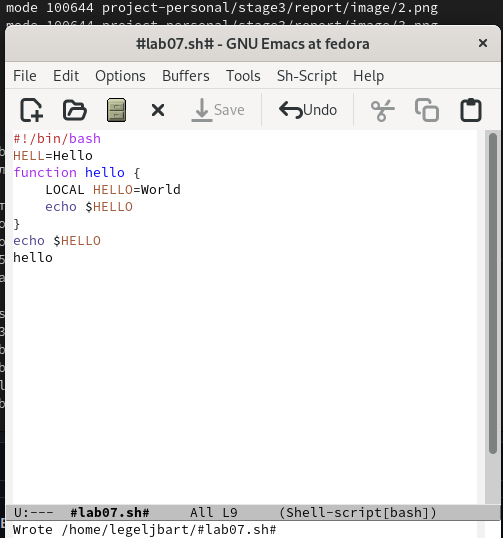{#fig:001 width=70%}

## Упражнения

- Вырезаем строку Ctrl-k 
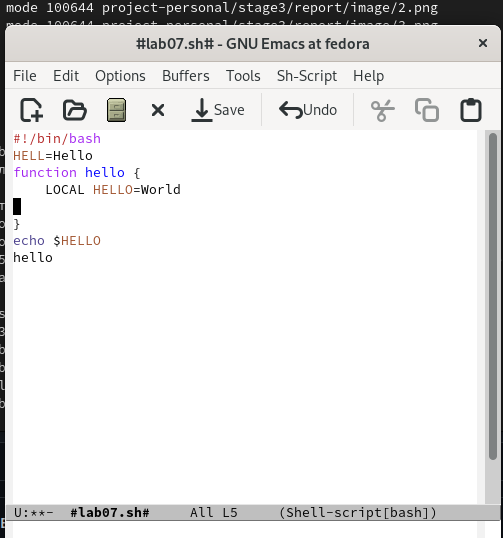{#fig:002 width=70%}

## Упражнения

- Вставляем в конец файла Ctrl-y 
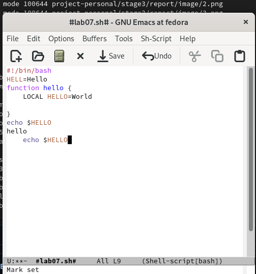{#fig:003 width=70%}

## Упражнения

- Выделяем часть текста Ctrl-space 
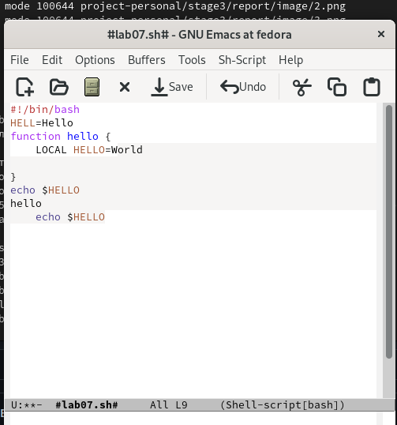{#fig:004 width=70%}

## Упражнения

- Другую выделенную часть копируем - вставляем Alt-w, Ctrl-y
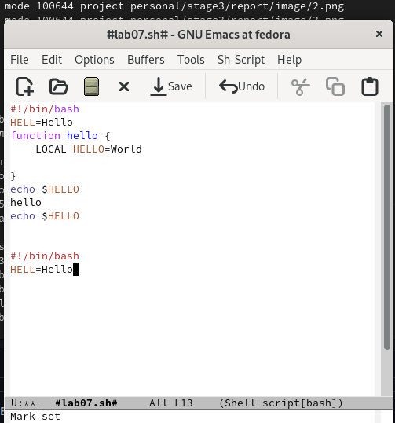{#fig:005 width=70%}

## Упражнения

- Снова выделяем, на этот раз вырезаем Ctrl-w 
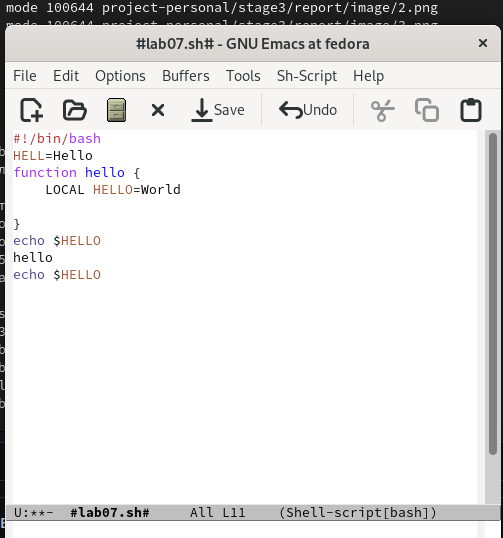{#fig:006 width=70%}

## Упражнения

- Отменяем последнее действие Ctrl-/ 
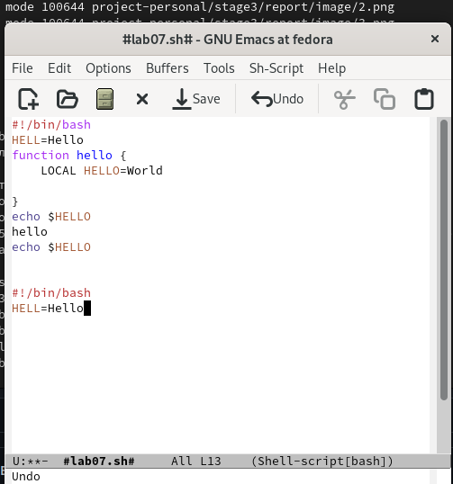{#fig:007 width=70%}

## Упражнения

- Теперь играем курсором. Ставим его в начало строки Ctrl-a 
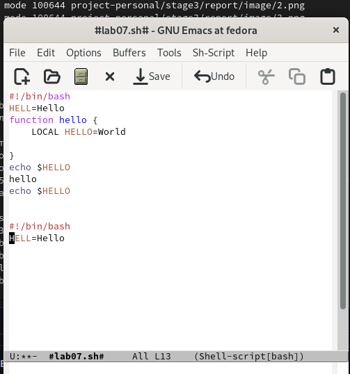{#fig:008 width=70%}

## Упражнения

- В конец строки Ctrl-e 
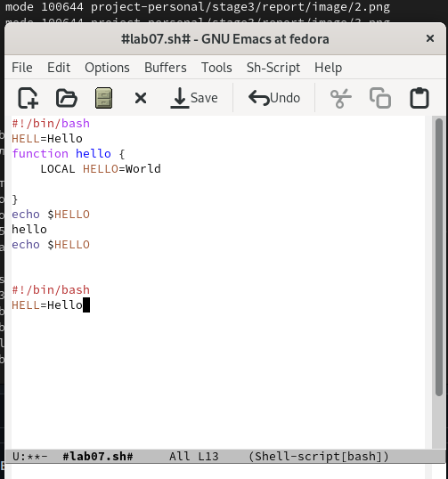{#fig:009 width=70%}

## Упражнения

- Перемещаемся в начало буфера Alt-< 
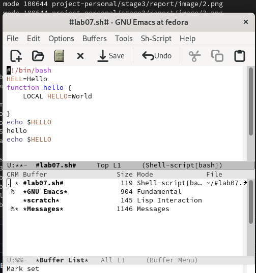{#fig:010 width=70%}

## Упражнения

- В конец буфера Alt-> 
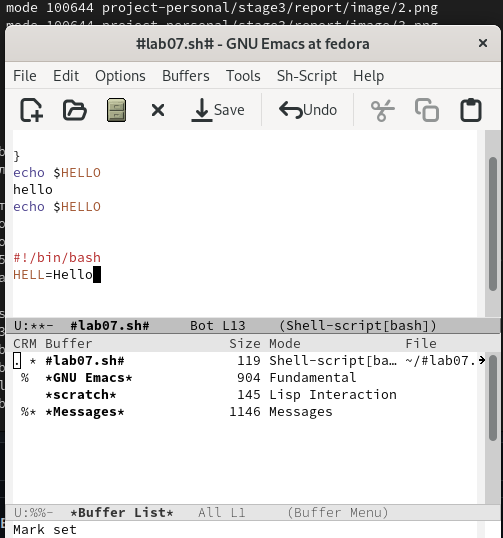{#fig:011 width=70%}

## Упражнения

- Теперь откроем список активных буферов на весь экран Ctrl-x Ctrl-b (он был и на предыдущих фото).
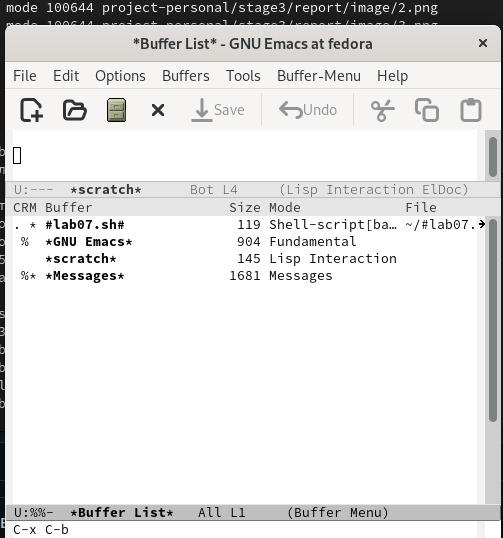{#fig:012 width=70%}

## Упражнения

- Открываем другой буфер Ctrl-x 
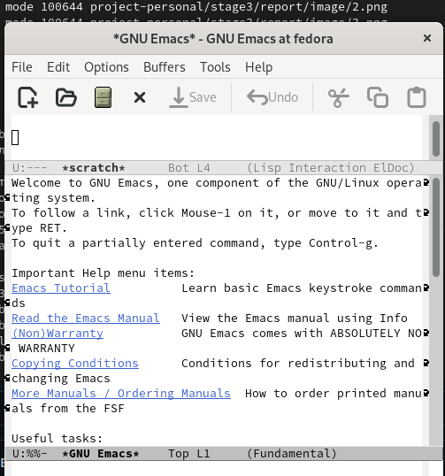{#fig:013 width=70%}

## Упражнения

- Теперь закрываем это окно Ctrl-x 0
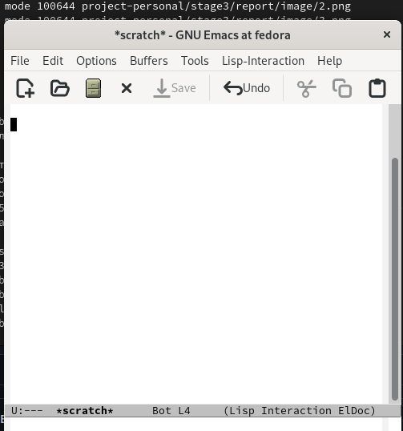{#fig:014 width=70%}

## Упражнения

- Переключаемся между буферами, но не выводя меню в явном виде Ctrl-x b 
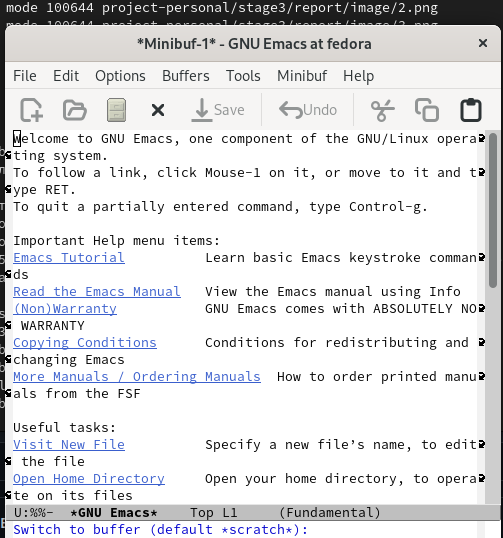{#fig:015 width=70%}

## Упражнения

- Теперь раскроим фрейм на 4 окна Ctrl-x 3, затем в каждой половине Ctrl-x 2
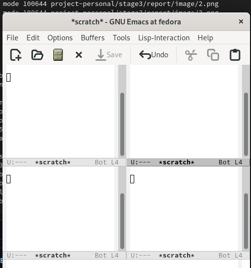{#fig:016 width=70%}

## Упражнения

- В каждом окне создадим свой буфер и напишем в каждом свой случайный набор букв Ctrl-x Ctrl-f. Поищем в одном буфере букву "е" Ctrl-s
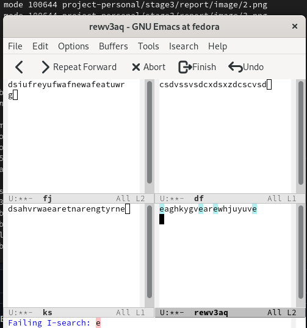{#fig:017 width=70%}

## Упражнения

- Переключимся на другой результат поиска Ctrl-s
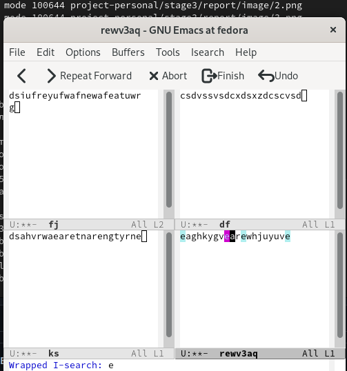{#fig:018 width=70%}

## Упражнения

- Выходим из поиска Ctrl-g
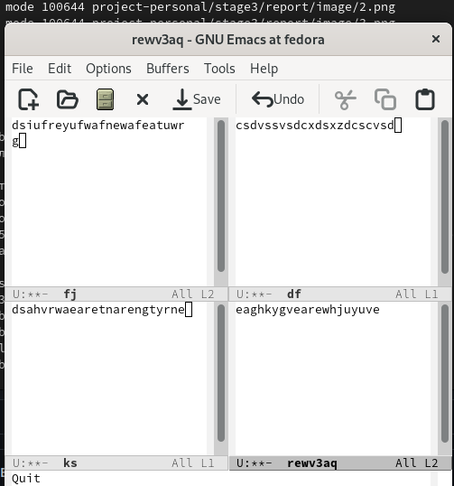{#fig:019 width=70%}

## Упражнения

- Запросим поиск текста на изменение Alt-% 
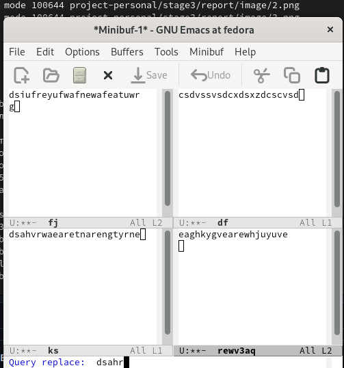{#fig:020 width=70%}

## Упражнения

- Введем текст, на который надо совершить замену
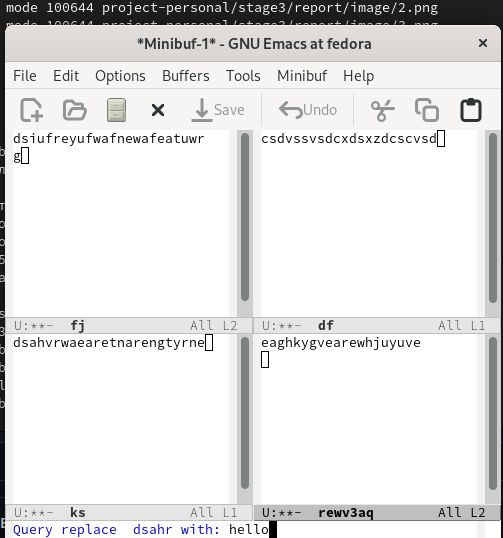{#fig:021 width=70%}

## Упражнения

- Теперь задействуем иную модель поиска. Это поиск не посимвольно, а поиск по строке Alt-s 0
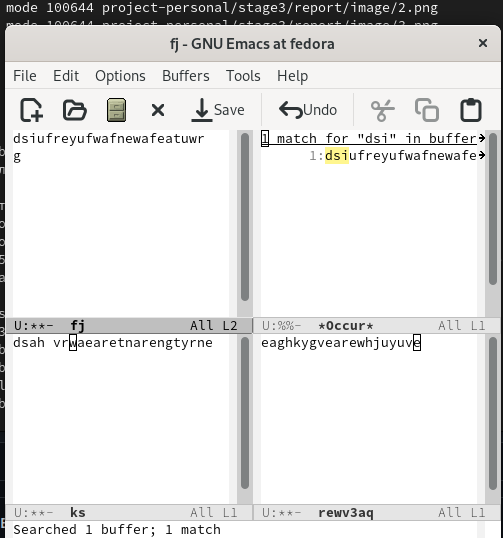{#fig:022 width=70%}

## Выводы

- Был освоен редактор emacs со своим функционалом и интерфейсом.

