---
## Front matter
title: "Отчёт по лабораторной работе"
author: "Лев Гельбарт"

## Generic otions
lang: ru-RU
toc-title: "Содержание"

## Bibliography
bibliography: bib/cite.bib
csl: pandoc/csl/gost-r-7-0-5-2008-numeric.csl

## Pdf output format
toc: true # Table of contents
toc-depth: 2
lof: true # List of figures
lot: true # List of tables
fontsize: 12pt
linestretch: 1.5
papersize: a4
documentclass: scrreprt
## I18n polyglossia
polyglossia-lang:
  name: russian
  options:
	- spelling=modern
	- babelshorthands=true
polyglossia-otherlangs:
  name: english
## I18n babel
babel-lang: russian
babel-otherlangs: english
## Fonts
mainfont: PT Serif
romanfont: PT Serif
sansfont: PT Sans
monofont: PT Mono
mainfontoptions: Ligatures=TeX
romanfontoptions: Ligatures=TeX
sansfontoptions: Ligatures=TeX,Scale=MatchLowercase
monofontoptions: Scale=MatchLowercase,Scale=0.9
## Biblatex
biblatex: true
biblio-style: "gost-numeric"
biblatexoptions:
  - parentracker=true
  - backend=biber
  - hyperref=auto
  - language=auto
  - autolang=other*
  - citestyle=gost-numeric
## Pandoc-crossref LaTeX customization
figureTitle: "Рис."
tableTitle: "Таблица"
listingTitle: "Листинг"
lofTitle: "Список иллюстраций"
lotTitle: "Список таблиц"
lolTitle: "Листинги"
## Misc options
indent: true
header-includes:
  - \usepackage{indentfirst}
  - \usepackage{float} # keep figures where there are in the text
  - \floatplacement{figure}{H} # keep figures where there are in the text
---

# Цель работы

Здесь цель - разобраться с редактором emacs, с его интерфейсом и функционалом.

# Выполнение лабораторной работы

Начнем написав emacs, этим запускаем редактор. Создаем файл Ctrl-x Ctrl-f. Вписываем в него нужный нам текст, сохраняем его Ctrl-x Ctrl-s (рис. @fig:001).

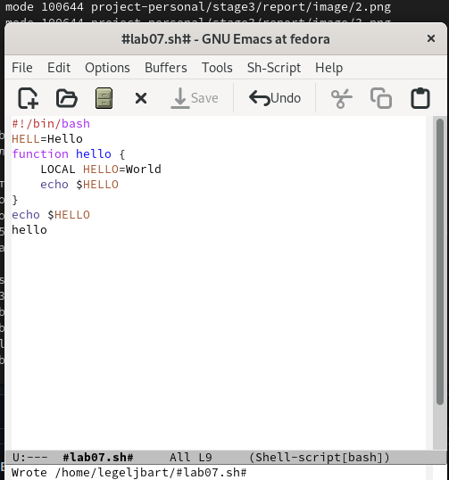{#fig:001 width=70%}

Вырезаем строку Ctrl-k (рис. @fig:002).

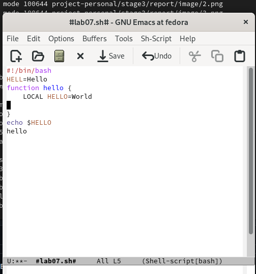{#fig:002 width=70%}

ставляем в конец файла Ctrl-y (рис. @fig:003).

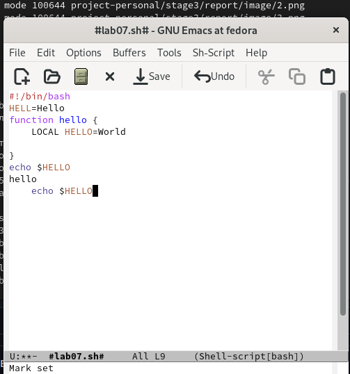{#fig:003 width=70%}

Выделяем часть текста Ctrl-space (рис. @fig:004).

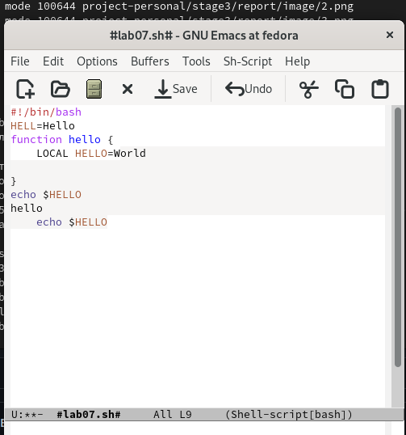{#fig:004 width=70%}

Другую выделенную часть копируем - вставляем Alt-w, Ctrl-y(рис. @fig:005).

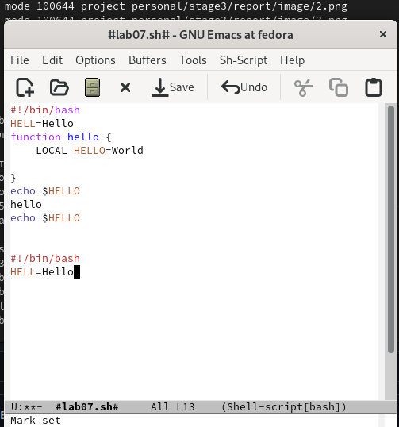{#fig:005 width=70%}

Снова выделяем, на этот раз вырезаем Ctrl-w (рис. @fig:006). 

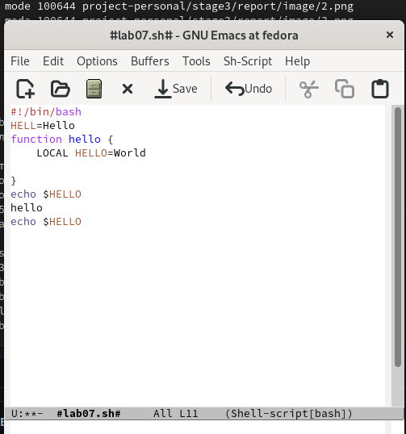{#fig:006 width=70%}

Отменяем последнее действие Ctrl-/ (рис. @fig:007).

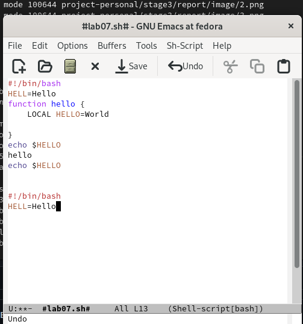{#fig:007 width=70%}

Теперь играем курсором. Ставим его в начало строки Ctrl-a (рис. @fig:008).

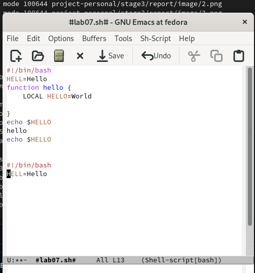{#fig:008 width=70%}

В конец строки Ctrl-e (рис. @fig:009).

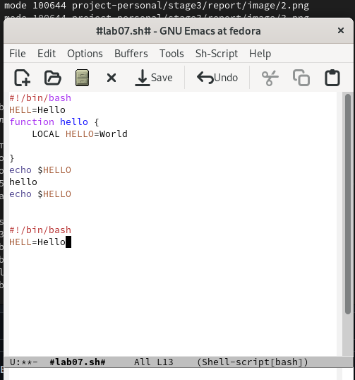{#fig:009 width=70%}

Перемещаемся в начало буфера Alt-< (рис. @fig:010). 

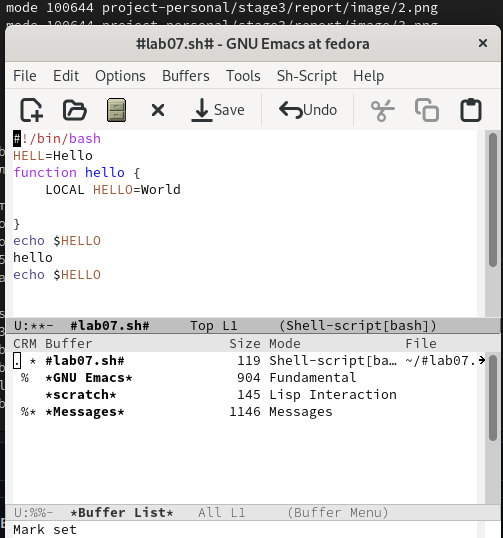{#fig:010 width=70%}

В конец буфера Alt-> (рис. @fig:011). 

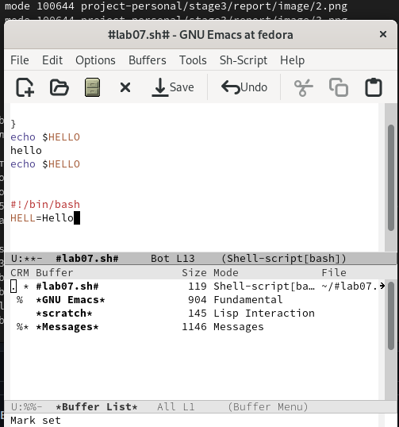{#fig:011 width=70%}

Теперь откроем список активных буферов на весь экран Ctrl-x Ctrl-b (рис. @fig:012) (он был и на предыдущих фото).

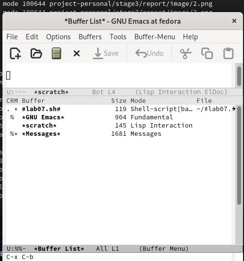{#fig:012 width=70%}

Открываем другой буфер Ctrl-x (рис. @fig:013). 

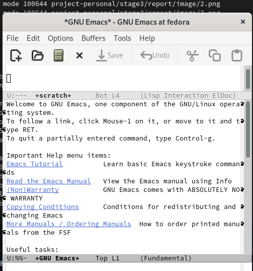{#fig:013 width=70%}

Теперь закрываем это окно Ctrl-x 0(рис. @fig:014).

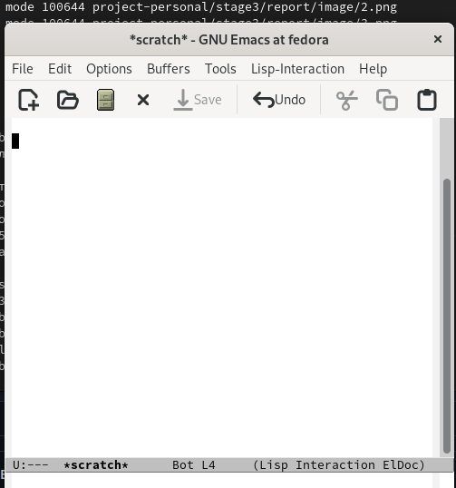{#fig:014 width=70%}

Переключаемся между буферами, но не выводя меню в явном виде Ctrl-x b (рис. @fig:015).

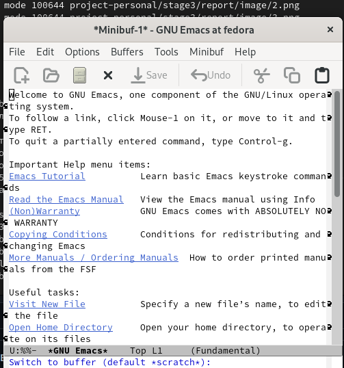{#fig:015 width=70%}

Теперь раскроим фрейм на 4 окна Ctrl-x 3, затем в каждой половине Ctrl-x 2 (рис. @fig:016).

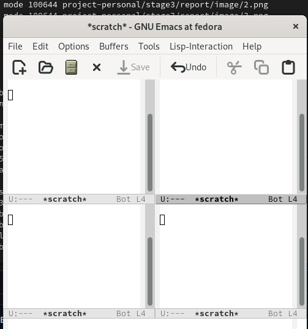{#fig:016 width=70%}

В каждом окне создадим свой буфер и напишем в каждом свой случайный набор букв Ctrl-x Ctrl-f. Поищем в одном буфере букву "е" Ctrl-s (рис. @fig:017).

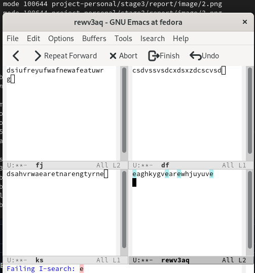{#fig:017 width=70%}

Переключимся на другой результат поиска Ctrl-s (рис. @fig:018). 

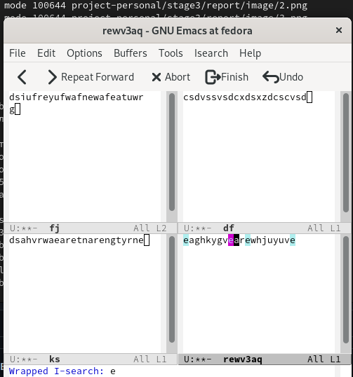{#fig:018 width=70%}

Выходим из поиска Ctrl-g (рис. @fig:019).

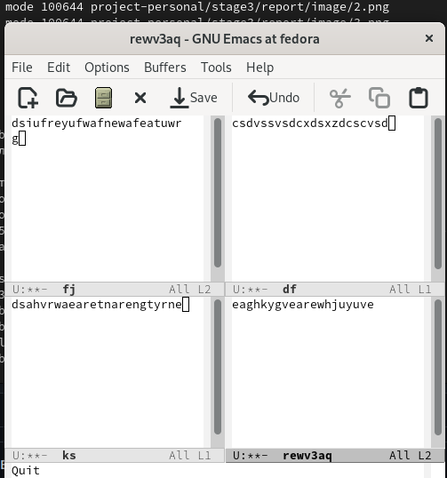{#fig:019 width=70%}

Запросим поиск текста на изменение Alt-% (рис. @fig:020).

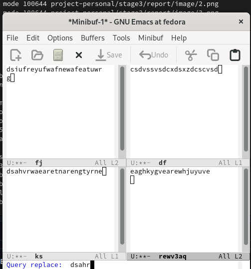{#fig:020 width=70%}

Введем текст, на который надо совершить замену (рис. @fig:021).

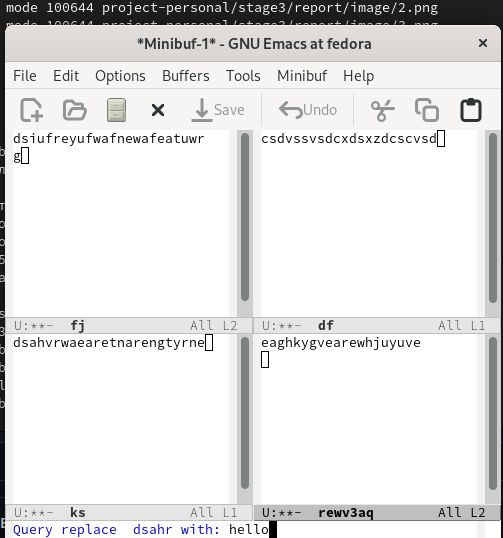{#fig:021 width=70%}

Теперь задействуем иную модель поиска. Это поиск не посимвольно, а поиск по строке Alt-s 0 (рис. @fig:022).

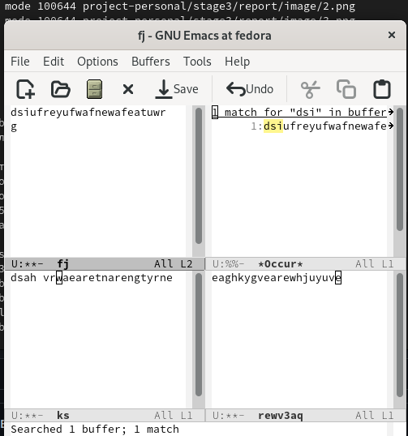{#fig:022 width=70%}

# Выводы

Был освоен редактор emacs со своим функционалом и интерфейсом.

