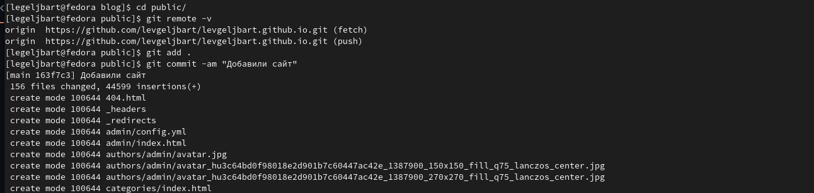

---
## Front matter
title: "Индивидуальный проект: этап 1"
subtitle: "Создание по шаблону персонального сайта"
author: "Лев Гельбарт"

## Generic otions
lang: ru-RU
toc-title: "Содержание"

## Bibliography
bibliography: bib/cite.bib
csl: pandoc/csl/gost-r-7-0-5-2008-numeric.csl

## Pdf output format
toc: true # Table of contents
toc-depth: 2
lof: true # List of figures
lot: true # List of tables
fontsize: 12pt
linestretch: 1.5
papersize: a4
documentclass: scrreprt
## I18n polyglossia
polyglossia-lang:
  name: russian
  options:
	- spelling=modern
	- babelshorthands=true
polyglossia-otherlangs:
  name: english
## I18n babel
babel-lang: russian
babel-otherlangs: english
## Fonts
mainfont: PT Serif
romanfont: PT Serif
sansfont: PT Sans
monofont: PT Mono
mainfontoptions: Ligatures=TeX
romanfontoptions: Ligatures=TeX
sansfontoptions: Ligatures=TeX,Scale=MatchLowercase
monofontoptions: Scale=MatchLowercase,Scale=0.9
## Biblatex
biblatex: true
biblio-style: "gost-numeric"
biblatexoptions:
  - parentracker=true
  - backend=biber
  - hyperref=auto
  - language=auto
  - autolang=other*
  - citestyle=gost-numeric
## Pandoc-crossref LaTeX customization
figureTitle: "Рис."
tableTitle: "Таблица"
listingTitle: "Листинг"
lofTitle: "Список иллюстраций"
lotTitle: "Список таблиц"
lolTitle: "Листинги"
## Misc options
indent: true
header-includes:
  - \usepackage{indentfirst}
  - \usepackage{float} # keep figures where there are in the text
  - \floatplacement{figure}{H} # keep figures where there are in the text
---

# Цель работы

Создать на основе Hugo Academic Theme по шаблону из Github персональный сайт научного работника. 

# Выполнение лабораторной работы

Скачивается из репозитория архив с Hugo, затем по шаблону репозитория сайта создается свой репозиторий (рис. @fig:001).

{#fig:001 width=70%}

В папке, в которую был скопирован на компьютер первый репозиторий, запускаем ~/bin/hugo server (рис. @fig:002, fig:003). Здесь же копируем на компьютер второй репозиторий, который и станет сайтом.

{#fig:002 width=70%}

{#fig:003 width=70%}

Затем в папке второго репозитория создаем ветку main, переключаемся на нее. Здесь создаем пустой файл, выгружаем в github (рис. @fig:004).

{#fig:004 width=70%}

Попытавшись выполнить команду с субмодулем, наткнемся на проблему с gitignore (рис. @fig:005). Чтобы ее решить, в файле gitignore надо закомментировать слово public.

{#fig:005 width=70%}

Это выполняем в mc. На экран выводим текст gitignore (рис. @fig:006). Повторим команду субмодуля. Выполним ~/bin/hugo

{#fig:006 width=70%}

Переместимся в папку public, оттуда проверим ее связь с репозиторием на github, выгрузимся туда (рис. @fig:007, @fig:008).

{#fig:007 width=70%}

{#fig:008 width=70%}

И вот, мы создали персональный сайт (рис. @fig:009).

{#fig:009 width=70%}

# Выводы

Был создан персональный сайт научного сотрудника.
