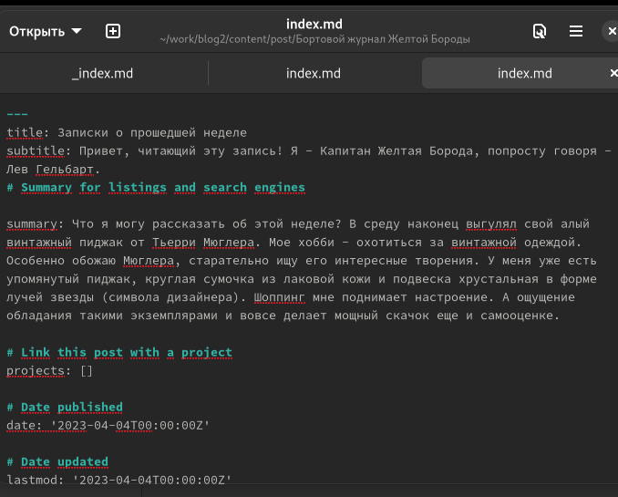
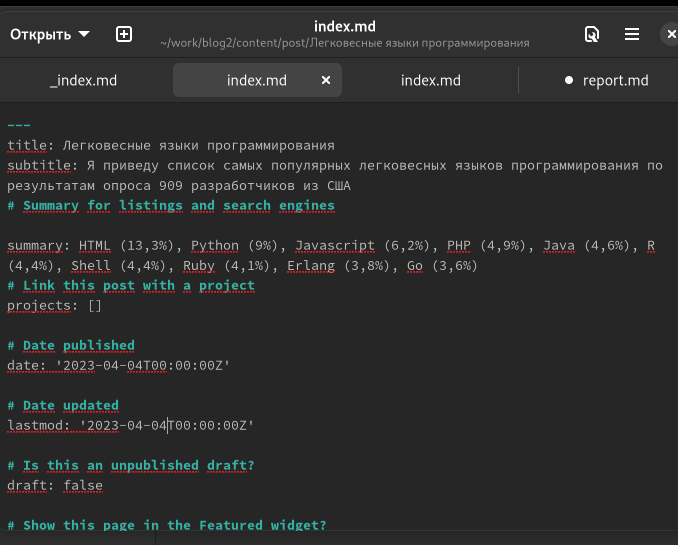
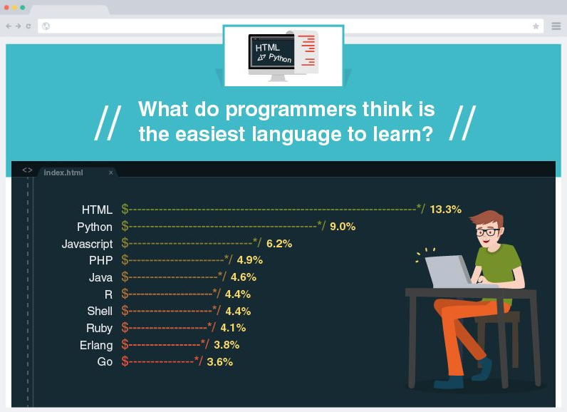
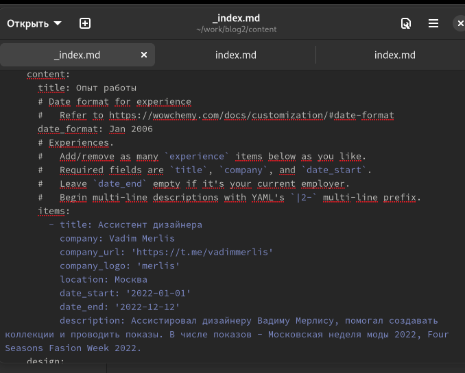
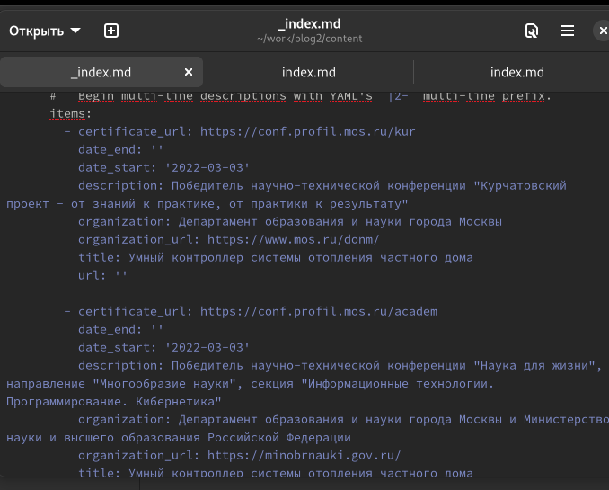
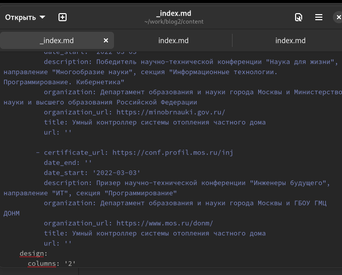

---
## Front matter
lang: ru-RU
title: Презентация по 3 стадии проекта
author:
  - Гельбарт Лев
institute:
  - Российский университет дружбы народов, Москва, Россия
date: 08 апреля 2023

## i18n babel
babel-lang: russian
babel-otherlangs: english

## Formatting pdf
toc: false
toc-title: Содержание
slide_level: 2
aspectratio: 169
section-titles: true
theme: metropolis
header-includes:
 - \metroset{progressbar=frametitle,sectionpage=progressbar,numbering=fraction}
 - '\makeatletter'
 - '\beamer@ignorenonframefalse'
 - '\makeatother'
---

## Цели и задачи
- Выгрузить на персональный сайт: 
- опыт работы
- достижения 
- пост про прошедшую неделю
- пост про легковесные языки программирования.

## Пост о прошедшей неделе

{#fig:001 width=70%}

{#fig:002 width=70%}

## Пост о легковесных языках программирования

{#fig:003 width=70%}

{#fig:004 width=70%}

## Опыт работы

{#fig:005 width=70%}

## Достижения и награды

{#fig:006 width=70%}

{#fig:007 width=70%}

## Результаты

- Внесены данные об опыте работы, достижениях, написаны посты о прошлой неделе и о легковесных языках программирования.

